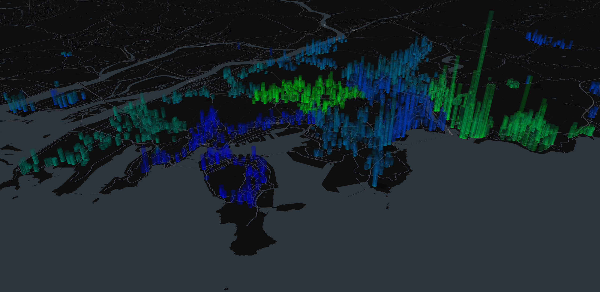

# Floating-population

To investigate the impact of commuting population flows on housing prices in Busan, we collected commuting population data by district in Busan. 
This data was then merged with our existing hedonic dataset based on date and location to create an aggregated hedonic dataset.

(Aggregation process?) 

Data in this repository consists of Excel and CSV files:

- *Busan Commuting Population.xlsx*: Raw data of commuting population by district in Busan.
- *Hedonic data.csv*: Aggregated hedonic dataset of 53,458 observations with 26 variables


## Plotting commuting population and price


In order to easily visualize the distribution of commuting population, housing prices, and their relationship, it is crucial to plot the data for a clear overview. 


The following code performs the above step. (Note: Our code is written based on Google Colab.):
```python
!pip install pydeck
import pydeck
pydeck.__version__
mapbox_key =   # Write your mapbox key of pydeck library
!pip install mapboxgl
import mapboxgl
print(f"Mapboxgl Version: {mapboxgl.__version__}")
from google.colab import drive
import pandas as pd
drive.mount('/content/drive')
directory = # Write your directory
busan_path = directory + 'Hedonic data.csv'
busan = pd.read_csv(busan_path)

data = []
for _, row in busan.iterrows():
    d = {
        'latitude': row['y'],  
        'longitude': row['x'],  
        'properties': {
            'price': row['price'],     
            'commute': row['commute']  
        }
    }
    data.append(d)


json_string = json.dumps(data, ensure_ascii=False, indent=2)
txt_file_path = directory + 'busan_data.txt'
with open(txt_file_path, 'w', encoding='utf-8') as f:
    f.write(json_string)


with open(txt_file_path, "r") as f:
    geo = json.load(f)
!pip install pydeck
!pip install geemap
import pydeck as pdk
busan_mini = busan[['x','y']].copy()
max_index_value = max(float(item["properties"]["price"]) for item in geo)
min_index_value = min(float(item["properties"]["price"]) for item in geo)
max_index_value1 = max(float(item["properties"]["commute"]) for item in geo)
min_index_value1 = min(float(item["properties"]["commute"]) for item in geo)
pdk.settings.mapbox_key = mapbox_key
from IPython.display import HTML
import colorsys

def minmax(value, min_value, max_value):
    return (value - min_value) / (max_value - min_value)

def calculate_color(item):
    index_value = float(item["properties"]["commute"])
    minmax_value = minmax(index_value, min_index_value1, max_index_value1)
    return [0, 255 * minmax_value, 255 * (1 - minmax_value), 255]


def calculate_elevation(item):
    index_value2 = float(item["properties"]["price"])
    minmax_value = minmax(index_value2, min_index_value, max_index_value)
    return minmax_value * 6000

geo_transformed_2 = [
    {
        "longitude": float(item["longitude"]),
        "latitude": float(item["latitude"]),
        "color": calculate_color(item),
        "elevation": calculate_elevation(item) 
    }
    for item in geo
]

elevation_values = [int(item['elevation']) for item in geo_transformed_2]
max_elevation = max(elevation_values)

color_values = [item['color'] for item in geo_transformed_2]

busan_mini['elevation'] = elevation_values
busan_mini['color'] = color_values
lon, lat = 129.0708802, 35.1153616
layer11 = pdk.Layer(
    'ScatterplotLayer',
  #  geo_latlong_transformed_2,
    get_position = '[longitude, latitude]',
    get_color = '[255, 255, 255, 255]',
    get_radius=100
)

layer22 = pdk.Layer(
    'ColumnLayer',
    busan_mini,
    extruded=True,
    get_position='[x,y]',
    get_fill_color = 'color',
    # get_color = '[255,255,255]',
    get_elevation='elevation',
    elevation_scale=1,
    elevation_range=[0, max_elevation],
    pickable=False,
    auto_highlight=False,
    radius=100,
    opacity= 0.01
)

view_state = pdk.ViewState(longitude= lon, latitude= lat, zoom=12.5, pitch=70, bearing=-27.36)
r = pdk.Deck(layers=[layer11, layer22], initial_view_state=view_state)
data_result = r.to_html('result.html',as_string=True)
```


Figure 1 illustrates the visualization results, presenting a plot where housing prices are shown as height and commuting population is represented by color—darker blue shades indicate lower values, while brighter colors represent higher values.


<p align="center">
   <br>
  Figure 1. Visualization of commuting population and apartment prices in Busan.
</p>
