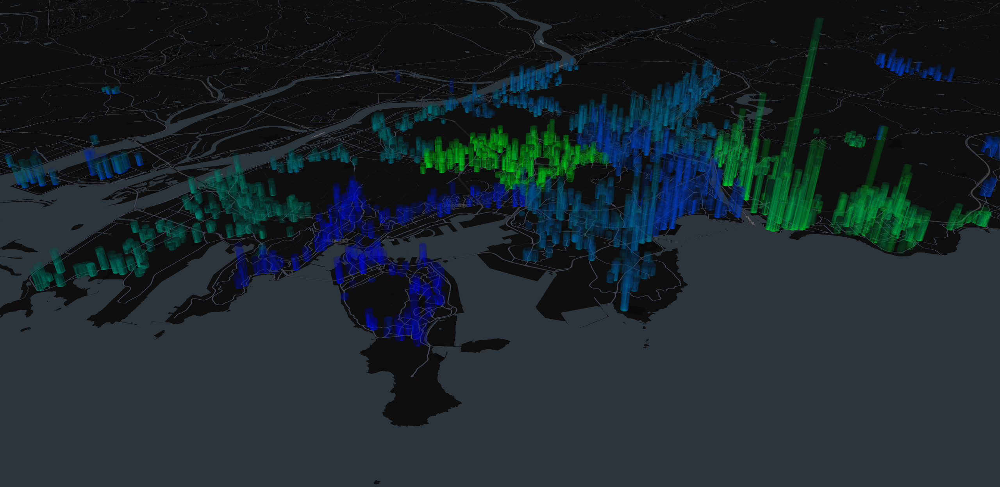

   
# Floating-Population

To investigate the impact of commuting population flows on housing prices in Busan, we collected commuting population data by district in Busan. 
This data was then merged with our existing hedonic dataset based on date and location to create an aggregated hedonic dataset.

Data in this repository consists of Excel and CSV files:

- *Busan Commuting Population.xlsx*: Raw data of commuting population by district in Busan.
- *Hedonic data.csv*: Aggregated hedonic dataset of 53,458 observations with 26 variables


## Plotting commuting population and housing prices


In order to easily visualize the distribution of commuting population, housing prices, and their relationship, it is crucial to plot the data for a clear overview. 

The columns required to effectively plot the image are as follows:

- x: Longitude in the Cartesian coordinate system of each data point 
- y: Latitude in the Cartesian coordinate system of each data point
- price: Housing price of each data point
- commute: Commuting population of each data point


The following code performs the above step:
```python
import pydeck as pdk
import pandas as pd
import json
from IPython.display import HTML
import colorsys

# Define your Mapbox API key
mapbox_key = "your_mapbox_key_here"  # Replace with your Mapbox key
pdk.settings.mapbox_key = mapbox_key

# Path to your data file
directory = "your_directory_here/"  # Replace with your directory
busan_path = directory + "Hedonic data.csv"

# Load data
busan = pd.read_csv(busan_path)

# Transform data into a GeoJSON-like structure
data = []
for _, row in busan.iterrows():
    d = {
        "latitude": row["y"],  
        "longitude": row["x"],  
        "properties": {
            "price": row["price"],     
            "commute": row["commute"]
        }
    }
    data.append(d)

# Save data as a JSON string
json_string = json.dumps(data, ensure_ascii=False, indent=2)
txt_file_path = directory + "busan_data.txt"
with open(txt_file_path, "w", encoding="utf-8") as f:
    f.write(json_string)

# Load the JSON data
with open(txt_file_path, "r") as f:
    geo = json.load(f)

# Functions to calculate color and elevation
def minmax(value, min_value, max_value):
    return (value - min_value) / (max_value - min_value)

def calculate_color(item):
    index_value = float(item["properties"]["commute"])
    minmax_value = minmax(index_value, min_index_value1, max_index_value1)
    return [0, 255 * minmax_value, 255 * (1 - minmax_value), 255]

def calculate_elevation(item):
    index_value2 = float(item["properties"]["price"])
    minmax_value = minmax(index_value2, min_index_value, max_index_value)
    return minmax_value * 6000

# Transform GeoJSON data
max_index_value = max(float(item["properties"]["price"]) for item in geo)
min_index_value = min(float(item["properties"]["price"]) for item in geo)
max_index_value1 = max(float(item["properties"]["commute"]) for item in geo)
min_index_value1 = min(float(item["properties"]["commute"]) for item in geo)

geo_transformed_2 = [
    {
        "longitude": float(item["longitude"]),
        "latitude": float(item["latitude"]),
        "color": calculate_color(item),
        "elevation": calculate_elevation(item)
    }
    for item in geo
]

# Prepare elevation and color data
elevation_values = [int(item["elevation"]) for item in geo_transformed_2]
max_elevation = max(elevation_values)
color_values = [item["color"] for item in geo_transformed_2]

# Add elevation and color to the DataFrame
busan_mini = busan[["x", "y"]].copy()
busan_mini["elevation"] = elevation_values
busan_mini["color"] = color_values

# Define map center
lon, lat = 129.0708802, 35.1153616

# Define layers
layer11 = pdk.Layer(
    "ScatterplotLayer",
    busan_mini,
    get_position="[x, y]",
    get_color="[255, 255, 255, 255]",
    get_radius=100
)

layer22 = pdk.Layer(
    "ColumnLayer",
    busan_mini,
    extruded=True,
    get_position="[x, y]",
    get_fill_color="color",
    get_elevation="elevation",
    elevation_scale=1,
    elevation_range=[0, max_elevation],
    pickable=False,
    auto_highlight=False,
    radius=100,
    opacity=0.01
)

# Set view state
view_state = pdk.ViewState(longitude=lon, latitude=lat, zoom=12.5, pitch=70, bearing=-27.36)

# Create and save PyDeck visualization
r = pdk.Deck(layers=[layer11, layer22], initial_view_state=view_state)
result_html_path = directory + "result.html"
data_result = r.to_html(result_html_path, as_string=True)

# Print completion message
print(f"Visualization saved to {result_html_path}")
```


Figure 1 illustrates the visualization results, presenting a 3D plot where housing prices are depicted as vertical bars, and commuting population is represented by a gradient of colors. The height of each bar corresponds to the relative housing price level, with taller bars indicating higher prices. Meanwhile, the color gradient conveys commuting population density, transitioning from darker blue for lower densities to brighter shades for higher densities, allowing for a comprehensive view of both variables and their spatial relationship across districts.


<p align="center">
   <br>
  Figure 1. Visualization of commuting population and housing prices in Busan.
</p>
